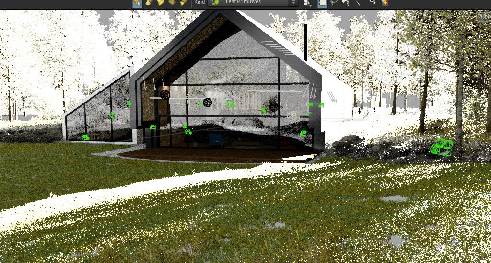
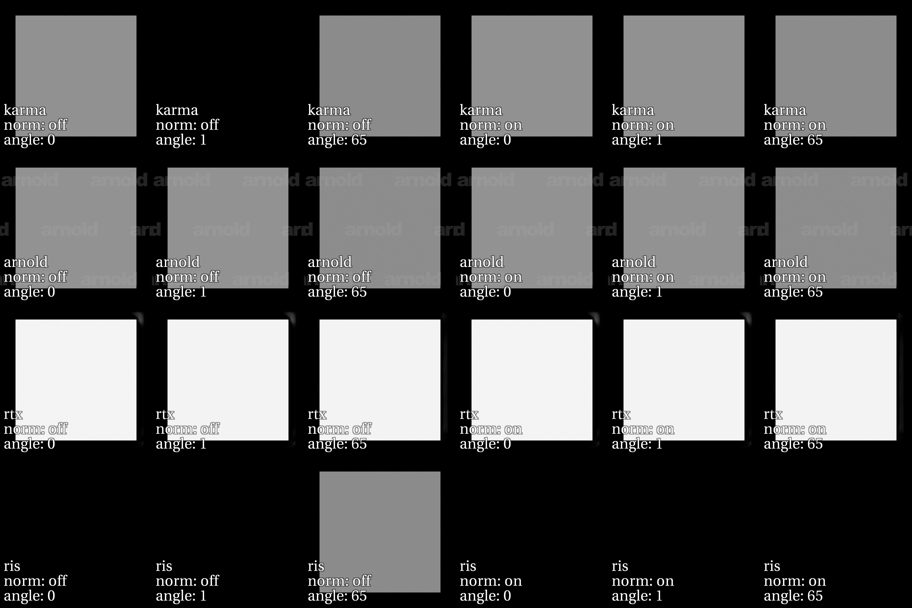
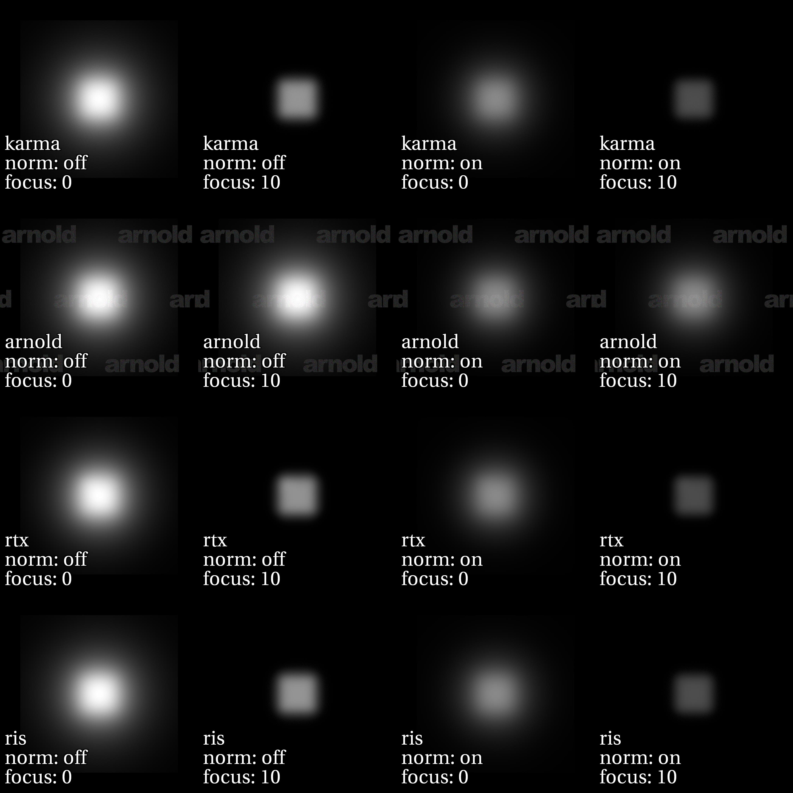

# Problem Statement

Different renderers produce very different images for the same USD due to differences in how certain lights are interpreted. For example, here's Intel's Moore Lane scene rendered in Karma, Arnold and RTX:

The issue here is that each renderer has its own interpretation of the quantity to be emitted given a particular parameterization of the distant light representiong the sun. Karma appears to be emitting nits when normalize is off and "lux at a patch facing the light" when normalize is on. Arnold and RTX both ignore the normalize flag, and RTX is essentially emitting "pi * lux". RIS does something else entirely:

# Solution
We need to update UsdLux to specify exactly what quantities should be emitted for each light and combination of its attributes so that lighting can be shared between applications and renderers.

# High-Level Plan
- [ ] Form working group with major rendering authors and users to decide on specification
- [ ] Enumerate all combinations of lighting attributes that affect the output and create contact sheets to show differences in implementation
- [ ] Reach consensus on what the implementation should be
- [ ] Draft a documentation update and/or new USD lighting Schema according to the decided specification
- [ ] Merge to USD
- [ ] Render happily ever after

# Contents of This Repository

## `light_comparison.hip`
Houdini project used to create USDs for testing, and to perform comparison renders in Solaris of Karma and Arnold (and eventually RIS hopefully). That was used to generate the following USD layers:

###  `cylinder-light-plane.usda` 
A cylinder light of length 1, radius 0.5 and intensity 30, 2 units above an 0.18-grey plane with the camera facing perpendicular to the plane.

###  `disk-light-plane.usda` 
A disk light of radius 0.5, and intensity 30, 2 units above and directly facing an 0.18-grey plane with the camera facing perpendicular to the plane.

###  `distant-light-plane.usda` 
A distant light of intensity 5, directly facing an 0.18-grey plane with the camera facing perpendicular to the plane.

###  `rect-light-plane.usda` 
A rect light of intensity 10, 1 unit above and directly facing an 0.18-grey plane with the camera facing perpendicular to the plane.

###  `sphere-light-plane.usda` 
A sphere light of radius 0.5, and intensity 30, 2 units above an 0.18-grey plane with the camera facing perpendicular to the plane.

### `dome-light.usda`
A dome light with intensity 1 and default transform using a coloured grid texture, illuminating a perfectly specular metallic sphere with the camera facing the sphere from 6 units along the Z axis.

## `renders`
Directory containing source renders for each scene/attribute combination, for each renderer

## `light_comparison.nk`
Nuke script used to generate the contact sheet images
